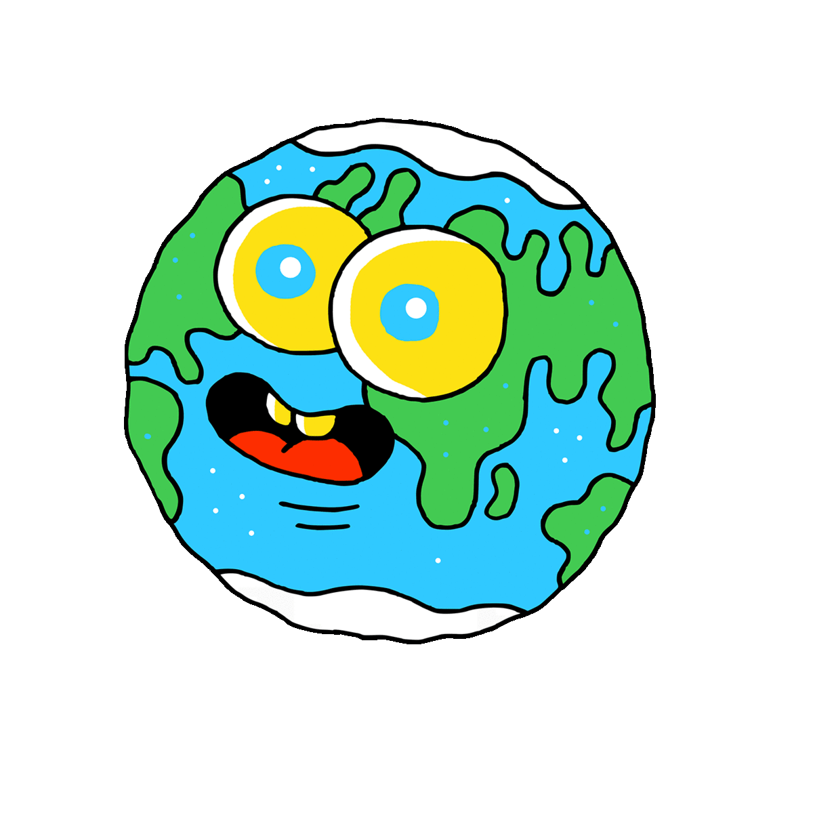
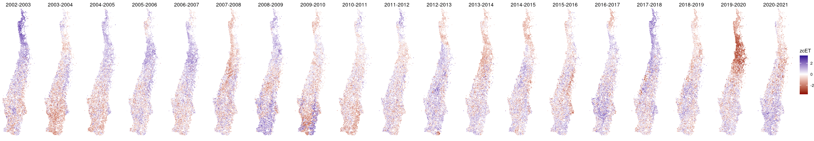

```{r setup, include=FALSE}
options(htmltools.dir.version = FALSE)
knitr::opts_chunk$set(
  fig.width=9, fig.height=3.5, fig.retina=3,
  out.width = "100%",
  cache = FALSE,
  echo = TRUE,
  message = FALSE, 
  warning = FALSE,
  hiline = TRUE
)
```

```{r xaringan-themer, include=FALSE, warning=FALSE}
library(xaringanthemer)
style_duo_accent(
  primary_color = "#1381B0",
  secondary_color = "#FF961C",
  inverse_header_color = "#FFFFFF",
  title_slide_text_color = "#72AD8F"
)
```
background-image: url("figs/variables_ambientales.png")
background-position: center
background-size: contain
## Overview

### Variables ambientales
---
background-image: url("figs/sos_eos_los.png")
background-position: center
background-size: contain

## Overview

### Fenología

---
## Overview

Datos satelitales a dos escalas:

.pull-left[
- Escala regional
  - MODIS (Landcover, fenología, IV, ET, FCV)
  - CHIRPS v2.0 (Precipitación)
  - Soil Grid 250m (parámetros físicos)
  - SMAP (Humedad de Suelo)

- Escala Local
  - Sentinel-2 (IV, FCV, LAI, FAPAR)
  - Sentinel-1 (HH, VV)

- Infraestructura para manejo de datos en la nube
  - R (stars, terra, sf, gdalcubes, rstac)
  - GEE (rgee)
  - STAC / COG
 ]
 .pull-right[
 
 ]
---
class: inverse center middle

# Escala regional
---
background-image: url("figs/landcover_pers.png")
background-position: 100% 50%
background-size: contain

### Landcover

- Producto MODIS MCD12Q1.006

  - 2001-2019

---
background-image: url("figs/landcover_sos_eos.png")
background-position: 50% 50%
background-size: contain

### Fenología

- MODIS MCD12Q2.051

---
background-image: url("figs/sos_eos_los.png")
background-position: center
background-size: contain

### Fenología

---
background-image: url("figs/map_zcNDVI_ts.png")
background-position: center
background-size: contain

### Anomalía estandarizada de NDVI acumulado

---
### Índices de sequía

Índice Estandarizado de Precipitación (SPI) 12 meses hasta EOS


Anomalía Estandarizada de le Evapotranspiración acumulada entre SOS-EOS


---
background-image: url("figs/r2_zcndvi_zcet.png")
background-position: 50% 50%
background-size: contain

.pull-left[

### Coeficiente de determinación entre zcNDVI y zcET
]

---
background-image: url("figs/pwp_fc_ha_100.png")
background-position: 100% 50%
background-size: contain

### Soil Grid 250m

.pull-left[
### Derivación de parámetros hídricos de suelo

- Punto de Marchitez Permanente (PMP)
- Capacidad de Campo (CC)
- Humedad Aprovechable (HA)
]
---
background-image: url("figs/swdi.jpeg")
background-position: 50% 100%
background-size: contain

### Soil Water Deficit Index (SWDI): 

`Soil Moisture Active Passive (SMAP)` -> $\theta$

$$SWDI = \frac{\theta-\theta_{CC}}{\theta_{HA}}$$
---
class: inverse center middle

# Escala local

---
background-image: url("figs/sentinel2.gif")
background-position: 100% 50%
background-size: contain

### Sentinel-2

---
background-image: url("figs/bandas_sentinel2.jpg")
background-position: 50% 50%
background-size: contain

### Resolución espectral y espacial

---
### Aplicación en {shiny} para el monitoreo de la vegetación

```{r echo=FALSE, out.height="100%"}
knitr::include_url("https://frzambra.shinyapps.io/fondecyt-maipo_app/",height="530px")
```

---
class: inverse center middle

# Infraestructura para manejo de datos en la nube

---
### Manejo de datos en la nube

.pull-left[
`Google Earth Engine (GEE)`

- Plataforma no es de código abierto.
- Manejada por Google
- Solo se pueden procesar datos satelitales
- Aún así `!Difícil vencer a GEE!`
]

.-pull-right[
STAC/COG (una alternativa)

- Open Source
- COG: Cloud Optimized GeoTiff es un nuevo sistema de almacenamiento de datos raster.
- COG: permite consultas más eficientes de áreas específicas.
- STAC: Spatio Temporal Asset Catalog
- STAC: sistema que permite describir largos set de datos geoespaciales
]


---
class: center, middle

# Gracias!

